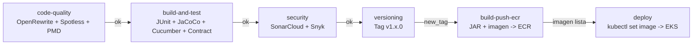

# ep03-backend

Backend REST de la aplicacion **Alumnos**, construido con **Spring Boot 3.5** y **Java 21**. Expone una API para gestion de ep03 con soporte para CRUD, exportacion/importacion CSV y documentacion OpenAPI integrada.

> **Proyecto EFT — ISY1101 Introducción a Herramientas DevOps (Duoc UC)**
> Este repositorio es uno de los tres componentes del sistema **Gestor de Alumnos**, desplegado en **Amazon EKS**:
> - 🗄️ Base de datos: [ep03-database](https://github.com/ikevin-p/ep03-database)
> - ⚙️ Backend (este repo): **ep03-backend**
> - 🖥️ Frontend: [ep03-frontend](https://github.com/ikevin-p/ep03-frontend)
>
> Guía del curso: [ISY1101-003V_EP03 · guia-04](https://github.com/mauriciovelasquezduoc/ISY1101-003V_EP03/tree/main/guia-04)


---

## Tecnologias

| Tecnologia          | Version   | Uso                              |
| ------------------- | --------- | -------------------------------- |
| Java                | 21 (LTS)  | Lenguaje principal               |
| Spring Boot         | 3.5.3     | Framework de aplicacion          |
| Spring Data JPA     | 3.5.x     | Persistencia ORM                 |
| Spring Security     | 6.x       | Seguridad y CORS                 |
| PostgreSQL          | 16        | Base de datos (dev y prod)       |
| H2                  | -         | Base de datos en memoria (tests) |
| Gradle              | 8.13      | Build tool                       |
| Springdoc OpenAPI   | 2.8.17    | Documentacion Swagger/ReDoc      |
| Lombok              | -         | Reduccion de boilerplate         |
| Cucumber            | 7.20      | Tests de aceptacion (BDD)        |
| Spring Cloud Contract | 4.2.3   | Tests de contrato                |
| JaCoCo              | 0.8.13    | Cobertura de codigo              |
| SonarCloud          | -         | Analisis de calidad continuo     |
| PIT Mutation Testing | 1.19     | Pruebas de mutacion              |

---

## Estructura del proyecto

```
ep03-backend/
├── src/
│   ├── main/
│   │   ├── java/cl/duocuc/ep03/
│   │   │   ├── application/          # Capa de servicio (casos de uso)
│   │   │   │   └── AlumnoService.java
│   │   │   ├── config/               # Seguridad y manejo de excepciones
│   │   │   │   ├── SecurityConfig.java
│   │   │   │   └── GlobalExceptionHandler.java
│   │   │   ├── domain/               # Modelo de dominio
│   │   │   │   └── Alumno.java
│   │   │   └── infrastructure/
│   │   │       ├── config/           # OpenAPI y CORS
│   │   │       ├── controller/       # AlumnoController (REST)
│   │   │       ├── entity/           # AlumnoEntity (JPA)
│   │   │       ├── mapper/           # AlumnoMapper (domain <-> entity)
│   │   │       └── repository/       # AlumnoRepository (JPA)
│   │   └── resources/
│   │       ├── application.yml       # Config base (H2 para tests)
│   │       ├── application-dev.yml   # Config desarrollo (PostgreSQL local)
│   │       └── application-prod.yml  # Config produccion (variables de entorno)
│   └── test/
│       ├── java/                     # Tests unitarios, contrato y BDD
│       └── resources/
│           ├── contracts/ep03/    # Contratos Spring Cloud Contract
│           ├── features/             # Escenarios Cucumber
│           └── application-test.yml
├── config/pmd/                       # Reglas PMD personalizadas
├── Dockerfile                        # Build multi-etapa (Gradle + JRE 21)
├── docker-compose.yml                # Stack local: app + base de datos
├── build.gradle                      # Dependencias y plugins
├── pgdata/                           # Datos persistentes PostgreSQL (bind mount)
│   └── data/                         # Datos reales (en .gitignore)
└── README.md
```

---

## Requisitos

| Herramienta    | Version minima |
| -------------- | -------------- |
| Docker         | 20.10+         |
| Docker Compose | 2.0+           |
| Java           | 21+ (solo para desarrollo local sin Docker) |
| Gradle         | 8.13+ (o usar `./gradlew`) |

---

## Inicio rapido con Docker

### 1. Asegurarse que ep03-db esta corriendo

Este compose asume que `ep03-db` ya esta levantado. Si no lo esta:

```bash
cd ../ep03-db
docker compose up -d
```

Verificar que esta healthy:

```bash
docker ps --filter "name=ep03-db"
```

### 2. Construir y levantar la app

```bash
docker compose up -d --build
```

### 3. Verificar que la app esta corriendo

```bash
docker compose ps
```

Resultado esperado:

```
NAME          STATUS       PORTS
ep03-backend   Up X seconds 0.0.0.0:8080->8080/tcp
```

### 4. Verificar que la app responde

```bash
curl http://localhost:8080/ep03
```

### 5. Detener la app

```bash
docker compose down
```

---

## Desarrollo local sin Docker

### 1. Compilar

```bash
./gradlew clean build -x test
```

### 2. Ejecutar con perfil dev (requiere PostgreSQL corriendo en localhost:5432)

```bash
./gradlew bootRun --args='--spring.profiles.active=dev'
```

### 3. Ejecutar tests

```bash
./gradlew test
```

---

## API REST

Base URL: `http://localhost:8080`

| Metodo | Endpoint          | Descripcion                    |
| ------ | ----------------- | ------------------------------ |
| GET    | `/ep03`        | Listar todos los ep03       |
| POST   | `/ep03`        | Crear un nuevo alumno          |
| PUT    | `/ep03/{id}`   | Actualizar un alumno existente |
| DELETE | `/ep03/{id}`   | Eliminar un alumno             |
| GET    | `/ep03/export` | Exportar ep03 en formato CSV |
| POST   | `/ep03/import` | Importar ep03 desde CSV     |

### Modelo de datos

```json
{
  "id": 1,
  "nombre": "Juan",
  "apellido": "Perez"
}
```

### Ejemplos de uso

**Listar ep03**
```bash
curl http://localhost:8080/ep03
```

**Crear alumno**
```bash
curl -X POST http://localhost:8080/ep03 \
  -H "Content-Type: application/json" \
  -d '{"nombre": "Laura", "apellido": "Vega"}'
```

**Actualizar alumno**
```bash
curl -X PUT http://localhost:8080/ep03/1 \
  -H "Content-Type: application/json" \
  -d '{"nombre": "Laura", "apellido": "Vega Soto"}'
```

**Eliminar alumno**
```bash
curl -X DELETE http://localhost:8080/ep03/1
```

**Exportar CSV**
```bash
curl http://localhost:8080/ep03/export
```

**Importar CSV**
```bash
curl -X POST http://localhost:8080/ep03/import \
  -H "Content-Type: text/plain" \
  -d "Laura,Vega
Pedro,Soto
Ana,Lopez"
```

---

## Documentacion de la API

| Interfaz   | URL                                      |
| ---------- | ---------------------------------------- |
| Swagger UI | http://localhost:8080/swagger-ui.html    |
| ReDoc      | http://localhost:8080/redoc.html         |
| OpenAPI JSON | http://localhost:8080/v3/api-docs      |

---

## Configuracion

### Perfiles de Spring

| Perfil  | Base de datos          | DDL        | Uso                        |
| ------- | ---------------------- | ---------- | -------------------------- |
| (none)  | H2 en memoria          | create-drop | Tests sin perfil activo   |
| `dev`   | PostgreSQL local       | update     | Desarrollo con Docker      |
| `prod`  | PostgreSQL via env vars | validate  | Produccion en AWS          |

### Variables de entorno (perfil prod)

| Variable                    | Descripcion                        | Ejemplo                                    |
| --------------------------- | ---------------------------------- | ------------------------------------------ |
| `SPRING_PROFILES_ACTIVE`    | Perfil activo                      | `prod`                                     |
| `DB_URL`                    | JDBC URL de PostgreSQL             | `jdbc:postgresql://10.0.2.5:5432/ep03`  |
| `DB_USERNAME`               | Usuario de la base de datos        | `ep03_user`                             |
| `DB_PASSWORD`               | Contrasena de la base de datos     | `ep03_pass`                             |
| `CORS_ORIGINS`              | Origenes permitidos para CORS      | `http://18.234.56.78`                      |

### Puertos

| Puerto host | Puerto contenedor | Servicio     |
| ----------- | ----------------- | ------------ |
| 8080        | 8080              | Spring Boot  |
| 5432        | 5432              | PostgreSQL   |

---

## Imagen Docker

| Propiedad    | Valor                 |
| ------------ | --------------------- |
| Base build   | `gradle:8.13.0-jdk21` |
| Base runtime | `eclipse-temurin:21-jre-jammy` |
| Imagen ECR   | `ep03-backend:latest`  |
| Puerto       | `8080`                |
| Usuario      | `appuser` (no-root)   |
| Healthcheck  | `GET /actuator/health` |

### Build multi-etapa

El Dockerfile usa dos etapas para minimizar el tamano de la imagen final:

1. **Build** — compila con Gradle y genera el JAR
2. **Runtime** — copia solo el JAR al JRE minimo, sin herramientas de build

### Construir la imagen manualmente

```bash
docker build -t ep03-backend:latest .
```

### Publicar en ECR

```bash
# Autenticarse en ECR
aws ecr get-login-password --region us-east-1 \
  | docker login --username AWS --password-stdin <ECR_REGISTRY>

# Tag y push
docker tag ep03-backend:latest <ECR_REGISTRY>/ep03-backend:latest
docker push <ECR_REGISTRY>/ep03-backend:latest
```

---

## Tests

### Ejecutar todos los tests

```bash
./gradlew test
```

### Reporte de cobertura (JaCoCo)

```bash
./gradlew jacocoTestReport
# Reporte en: build/reports/jacoco/test/html/index.html
```

Umbral minimo requerido: **80% instrucciones y 80% ramas**

### Tests de mutacion (PIT)

```bash
./gradlew pitest
# Reporte en: build/reports/pitest/index.html
```

### Tests de contrato (Spring Cloud Contract)

```bash
./gradlew contractTest
```

### Tests de aceptacion (Cucumber BDD)

Los escenarios estan en `src/test/resources/features/ep03.feature` y se ejecutan como parte del ciclo normal de tests.

---

## Calidad de codigo

### Verificar formato (Spotless)

```bash
./gradlew spotlessCheck
```

### Aplicar formato automaticamente

```bash
./gradlew spotlessApply
```

### Analisis estatico (PMD)

```bash
./gradlew pmdMain
# Reporte en: build/reports/pmd/
```

### Refactoring automatico (OpenRewrite)

```bash
# Solo ver que cambiaria (sin modificar archivos)
./gradlew rewriteDryRun

# Aplicar cambios
./gradlew rewriteRun
```

### Ejecutar todos los checks de calidad

```bash
./gradlew codeQuality
```

---

## Contexto en la arquitectura

Este servicio forma parte de la arquitectura de 3 capas del sistema **Gestor de Alumnos**, desplegada en un clúster **Amazon EKS** (`laboratorio-ep03-eks`), dentro del namespace `ep03`:

```
Usuario
   |
AWS ELB (Load Balancer publico)
   |
Frontend  (Service: ep03-frontend, LoadBalancer)  — Nginx :80
   |  proxy interno /ep03 -> backend:8080
Backend   (Service: ep03-backend, ClusterIP)  — Spring Boot :8080   <-- este servicio
   |  JDBC
Database  (Service: ep03-database, ClusterIP) — PostgreSQL :5432
```

- El backend se despliega como `Deployment` de Kubernetes (`ep03-backend`), con `strategy: Recreate` para evitar que convivan dos versiones del API contra el mismo esquema durante un rollout.
- Autoescalado horizontal vía `HorizontalPodAutoscaler`: 1 a 10 réplicas, activado sobre 70% de uso de CPU.
- Expuesto internamente solo vía `Service` tipo `ClusterIP` (`ep03-backend:8080`) — no tiene IP pública ni es alcanzable directamente desde internet; únicamente el frontend puede resolverlo por DNS interno del clúster.
- Se conecta a PostgreSQL vía el `Service` interno `ep03-database:5432`.
- Nodos worker gestionados por un Node Group EC2 dentro del clúster EKS, con el rol IAM `LabEksNodeRole` (equivalente conceptual al *Task Role* de ECS).
- El plano de control EKS opera con el rol IAM `LabEksClusterRole` (equivalente conceptual al *Execution Role* de ECS).

## Configuración y secretos en el clúster

| Recurso | Tipo | Contenido |
| --- | --- | --- |
| `database-secret` | `Secret` (Kubernetes) | `POSTGRES_PASSWORD`, referenciado por el backend vía `secretKeyRef` |
| `SPRING_PROFILES_ACTIVE` | Variable de entorno del `Deployment` | `prod` — activa `application-prod.yml` |
| `DB_URL` / `DB_USERNAME` | Variable de entorno del `Deployment` | Apuntan al Service interno `ep03-database` |
| `DB_PASSWORD` | `valueFrom.secretKeyRef` | Nunca se define como texto plano en el manifiesto |

Los valores de imagen, réplicas y límites de recursos se generan desde una configuración centralizada (`values.yaml`) en el repositorio de infraestructura del curso, evitando hardcodear parámetros en cada YAML.

## Notas de seguridad

- Las credenciales de la base de datos nunca se definen como texto plano: se inyectan desde un `Secret` de Kubernetes.
- La aplicación corre con usuario no-root (`appuser`) dentro del contenedor.
- CORS está restringido en producción al origen configurado en `CORS_ORIGINS`.
- Spring Security está habilitado; ajustar `SecurityConfig.java` según los requerimientos de autenticación del proyecto.
- Snyk (`--severity-threshold=high --fail-on=all`) bloquea el pipeline si aparecen vulnerabilidades de severidad alta o crítica en las dependencias.

---

## CI/CD — GitHub Actions

El pipeline está definido en [`.github/workflows/deploy-backend-eks.yml`](.github/workflows/deploy-backend-eks.yml) y se ejecuta automáticamente en cada `push` a `main` (también soporta `workflow_dispatch` manual). Es el pipeline más completo del sistema: calidad de código, tests con cobertura, seguridad, versionado semántico, publicación en ECR y despliegue en **Amazon EKS**, todo en secuencia estricta.

### Flujo del pipeline



> Si cualquier job falla, el pipeline se detiene y los jobs siguientes no se ejecutan.

### Job 0 — Code Quality

| Herramienta | Tarea | Falla si... |
|---|---|---|
| **OpenRewrite** | Detecta oportunidades de modernización (dry-run) | Hay recetas aplicables pendientes |
| **Spotless** | Verifica formato del código fuente | El código no cumple el formato definido |
| **PMD** | Análisis estático de reglas de calidad | Se violan las reglas del `ruleset.xml` |

### Job 1 — Build & Test

Compila el proyecto y ejecuta la suite completa de tests (JUnit, JaCoCo, Cucumber BDD, Spring Cloud Contract). Publica reportes de tests, cobertura y contratos como artefactos.

### Job 2 — Security Analysis

- **SonarCloud**: análisis estático de calidad con Automatic Analysis activo en el proyecto.
- **Snyk SCA**: escanea dependencias (`build.gradle`) con `--severity-threshold=high --fail-on=all`; genera además un reporte SARIF.

### Job 3 — Versioning

Calcula automáticamente la siguiente versión semántica (`v1.x.0`): busca el último tag `v1.*`, incrementa el número menor (o inicia en `v1.0.0` si no existe ninguno) y publica el tag con `github-actions[bot]`.

### Job 4 — Build & Push ECR

Genera el JAR de producción (`bootJar -x test`, sin repetir tests ya validados), construye la imagen con Docker Buildx y la publica en Amazon ECR con dos tags:

| Tag publicado | Ejemplo | Uso |
|---|---|---|
| Versión semántica | `ep03-backend:v1.4.0` | Trazabilidad histórica |
| `latest` | `ep03-backend:latest` | Tag usado por el paso de despliegue |

Usa GitHub Actions Cache (`type=gha`) para reutilizar capas entre builds.

### Job 5 — Deploy a EKS

1. Configura credenciales AWS temporales (Learner Lab) con `aws-actions/configure-aws-credentials`.
2. Autentica contra ECR y genera el `kubeconfig` con `aws eks update-kubeconfig --name laboratorio-ep03-eks`.
3. Valida acceso al clúster (`kubectl get nodes`).
4. Actualiza la imagen del `Deployment`: `kubectl set image deployment/ep03-backend backend=<ECR>/ep03-backend:<tag> -n ep03`.
5. Espera el rollout con `kubectl rollout status --timeout=600s`; si falla o excede el tiempo, imprime automáticamente `describe` y `logs` del deployment/pods para diagnóstico.
6. Verifica el estado final: pods, `Service` y `HorizontalPodAutoscaler`.

### Secrets requeridos (GitHub Secrets)

| Secret | Descripción |
| ------ | ----------- |
| `AWS_ACCESS_KEY_ID` / `AWS_SECRET_ACCESS_KEY` / `AWS_SESSION_TOKEN` | Credenciales temporales del AWS Academy Learner Lab |
| `AWS_REGION` | `us-east-1` |
| `EKS_CLUSTER_NAME` | `laboratorio-ep03-eks` — el job aborta con error explícito si falta |
| `SONAR_TOKEN` | Autenticación contra SonarCloud |
| `SNYK_TOKEN` | Autenticación contra Snyk |

### Permisos del workflow

| Permiso | Nivel | Razón |
| ------- | ----- | ----- |
| `contents: write` | Repositorio | Crear y publicar tags git |
